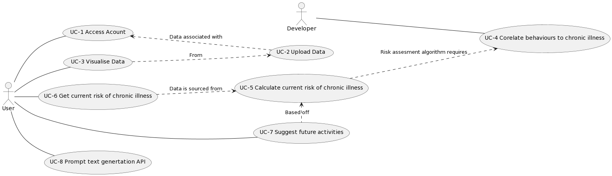
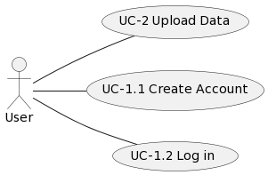

# 1. Introduction

## 1.1 Purpose 

This document contains the LifeLens system requirements and its analysis. Its purpose is to serve as a reference for the system design. The intended audience includes system designers, project supervisors, module coordinators and the CA326 module demonstration panel. 

## 1.2 Product Scope

The goal of development is to produce a web app called LifeLens

LifeLens is a web application that visualises and extracts meaningful insights from users' lifelog data. It is intended that users will collect their own lifelog data and upload it to the website under their own personal account. This lifelog data will include their daily activities and metadata collected from biometric sensors.

The system's primary goal is to make users' data clear and comprehensible to understand their health patterns. This goal is essential because a link exists between people's daily activities and chronic illnesses [1].  

The secondary goal of the system is to analyse the user's lifelog data and assess their current risk of chronic illnesses. The feature can provide users with a deeper understanding of their lifelog data. The system will suggest personalising future activities, such as exercise, to prevent the chronic illnesses the user is at considerable risk of.

The tertiary goal of the system is to incorporate a text generator API so that users can further discuss health patterns they noticed from the data visualisation. 

## 1.3 Definitions, Acronyms, and Abbreviations

- **BRFSS**: Stands for “Behavioral Risk Factor Surveillance Survey” and is a survey conducted by the CDC.
- **CDC**: Stands for “Centre for Disease Control and Prevention” and is a United States government public agency.
- **Chronic Illness**: A health condition or disease that is persistent or otherwise long-lasting in its effects or a disease that comes with time.
- **Lifelog**: A lifelog is a personal record of one's daily life in varying detail.

##1.4 References

1. Willett, W. C. Balancing Life-Style and Genomics Research for Disease Prevention. Science Vol. 296, 5568 (Apr. 2002), https://www.science.org/doi/10.1126/science.1071055 

2. Centres for Disease Control and Prevention (CDC), Behavioral Risk Factor Surveillance Survey, 2014-edition, last updated Nov. 21, 2018,  https://data.world/healthdatany/ttzx-73qb (accessed Nov 26. 2023) 

3. S. Chung, ETRI lifelog Dataset, 2020 edition, last updated Mar. 17, 2022, https://nanum.etri.re.kr/share/list?lang=En_us (accessed Nov. 26, 2023)

# 2. Overall Description

## 2.1 Product Perspective

Lifelog is a self-contained product with two purposes:
1:  Turn the user’s lifelog data from raw data into a clear, comprehensible form through data visualisation.
2: Prevent chronic illness by identifying the user’s current risk and suggesting behavioural changes to reduce that risk.

## 2.2 Product Functions 

* Figure 1: Context level use cases* 

A user wants to create an account on the LifeLens web application to visualise their lifelog data.

* Figure 2: User account actions*

Once users have logged into their account and lifelog data have been uploaded to the system; it can be visualised with various graphs and charts highlighting the frequency of daily activities and health patterns.

A Developer wants to Correlate behaviours to Chronic illness. Behaviours and chronic illnesses that are being correlated are as follows: 

| Chronic Illness                                                        | Behavior                |
|------------------------------------------------------------------------|-------------------------|
| Depression                                                             | Alcohol consumption     |
| Asthma                                                                 | Smoking                 |
| Cancer                                                                 | Exercise                |
| Chronic obstructive pulmonary disease, emphysema or chronic bronchitis | Sleep                   |
| Kidney Disease                                                         | Diet                    |
| Alzheimer's                                                            | Stress                  |
| Heart attack                                                           | Recreational activities |
| Stroke                                                                 | Job type                |
| Diabetes                                                               |                         |
| Arthritis                                                              |                         |

Now that the developer has correlated behaviour to chronic illnesses The system can provide the user with their current risk of chronic illness based on their behaviours seen in their lifelog data. Users are also offered suggested activities to reduce their risk of chronic illness.

* Figure 5: Chronic illness prevention use cases *

For users who want to ask questions or gain further insights about their data, a chatbot will be incorporated that queries a text generator API.

* Figure 6: Prompt text generation API use case *

## 2.3 User Classes and Characteristics

The intended users of this are:

1. **Health-conscious individuals.**  They are frequent users who would use the full range of features on the app. Their technical experience would be low, and they are an essential user to consider when developing the app.

2. **Individuals Managing Chronic Conditions.** They are frequent users who would use the full range of features on the app. Their technical experience would be low, and they are an essential user to consider when developing the app.

3. **Researchers and Data Analysts.** The frequency of use and features used would vary based on research. Their technical experience would be high. As a user, they are unimportant to the project's development.

4. **Healthcare Professionals.**  Frequency depends on interest and patients' willingness to collect lifelog data. They would use the visualisation features. They have high technical experience and a deep understanding of health patterns. Their importance when developing the app is low.

## 2.4  Design and Implementation Constraints

- **UI constraints** Requires a frontend UI library such as React.js or Node.js. 

- **Backend constraints**Requires a web framework such as Django or Flask.

- **Visualization Constraints** Requires a visualization library such as D3.js or Chart.js.

- **Criticality of the application** The mark of CA326 is bound to the development of this application

- **Safety and security Considerations** Due to the personal nature of lifelog data, security must be a priority.

## 2.5. Assumptions and Dependencies

Lifelens’s chronic illness risk assessment depends on the Behavioral Risk Factor Surveillance Survey data. BRFSS monitors modifiable risk behaviours alongside other factors contributing to the leading causes of morbidity and mortality. LifeLens will use this data to correlate behaviour to chronic illness for risk assessment on lifelog data [2].

Testing and demonstration are dependent on  ETRI’s lifelog dataset 2020 edition. This dataset consists of 30 people and has data collected from a range of biometric sensors and tracked 92 daily activities including but not limited to sleeping, medical services, walking, studying and smoking [3].

# 3. Functional Requirments

## 3.1 External Human Actor Descriptions

| ACT-1      |User                                                 |
|------------|-----------------------------------------------------|
|Description |A person who wants to access the app's functionality |
|Notes:      | Users are either inactive or active in use cases.   |

| ACT-1      |Developer                                                                                                 |
|------------|----------------------------------------------------------------------------------------------------------|
|Description |Is an admin user that uploads human behavioral-medical data for correlating behaviour to chronic illness. |
|Notes:      |The developer does not interface with a UI.                                                               |

## 3.2 Use cases

### 3.2.1.1 Use Case 1.1 Create Account

|UC-1.1        |step|Create Account                                                                                          | 
|--------------|----|---------------------------------------------------------------------------------------------------|
| Precondition | 1  |  A novice user wants to set up an account on LifeLens.                                             |
|              |2   |System indicates to the user to enter their email username and password.                            |
|              |3   |User enters their email, username and password.                                                     |
|              |3a  |The system throws an error if an account with the entered email is already registered.              |
|              |3b  |If an account with the same username exists, the system throws an error.                            |
|              |3c  |If the password is unsafe, the system throws an error.                                              |
|              |3d  |Password is encrypted, and email, username and password are saved to the database.                  |
|              |4   |The system sends an email confirming account creation.                                              |
|              |5   |The user is logged in.                                                                              |   
|              |6   |The home page is loaded.                                                                            |
|Postcondition |1   |A user account is created.                                                                          |                                                        
|Expectations |1   |The user will choose the appropriate username.                                                      |
|             |2   |The user will create an account with their email.                                                   |
| Notes       |    |If any condition for steps 3a - 3c are met, then the system breaks from the process; else, 3d is executed|