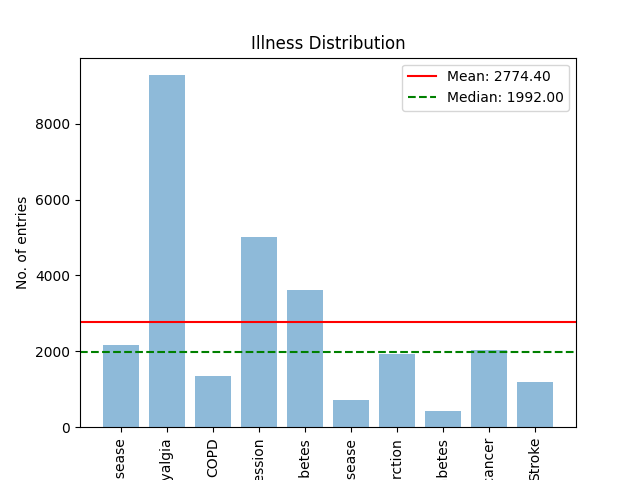

# Blog 3 - Data Pre-Processing

The data that I'm using for my risk assessment algorithm is from the CDC’s Behavioural Risk Factor Analysis Surveillance System. The data is of American adults and includes relevant data to me such as age, sleep, alcohol and tobacco consumption and activity. I am going to use this data to train a model that can take behaviour and user data and perform a risk assessment on a series of chronic illnesses. 

## Data Integration

To train a model I require a lot of data so that is why I concatenated BRSS data from 5 years(2010, 2012, 2013, 2014, 2015)  from 5 datasets. This gave me a total of 43211 rows,

## Data Decoding

I began by decoding relevant columns by mapping the values of each column to a dictionary that contained a string representation of the value. 

## Data Cleaning

I cleaned the data frame by creating a new data frame that excluded rows where the columns of interest had unknown values. This process removed 29666 rows. I then used the get_dummies() function from the panda's library that exploded the columns of interest into boolean columns for each possible value. I then used then filtered the dataset further by dropping every column that was one of these new boolean columns.

Here is the total number of behaviours and chronic illnesses present in the data.

## Data Balancing

 I started balancing by adding two new columns to the data frame, one was the number of illnesses the user is suffering from, and the other column was a list representation of the user's chronic illnesses. I started by visualising multi-illness distribution.

And the illness distribution:

The mean being much larger than the median signifies a rightward skew, which means there are a few outliers that have an overwhelming majority. This intuitively makes sense that some diseases will be more prevalent than others.  To handle multi-illness patients when balancing I divided the data set by the number of illnesses in each row. I then found the mean number of people inflicted by each combination of Illnesses in each division up to combinations of 5 illnesses. Each combination of illnesses was then under and over-sampled to the mean in their division. For reproducible, I used a seed in sampling which adds determinism to the function. To prevent overfitting the model I calculated the mean number of illnesses after balancing and oversampled entries without illnesses to that mean and inserted that into the balanced df balanced df

## Data Normalisation

Finally, I normalised both the balanced distribution data frame and the natural distribution data frame. The normalised data frames have two columns (Behaviour, Illness) which are both bit lists where a 1 represents the presence of that Behaviour/Illness and 0 represents an absence. This form makes the dataset machine-readable for future machine-learning models.

an example of the dataset in noraml form would look like : 

"[0, 0, 0, 0, 0, 0, 1, 0, 1, 0, 0, 0, 1, 0, 0, 0, 1]","[1, 0, 0, 0, 0, 0, 0, 0, 0, 1]" 

## Refrences 
[Find out more about BRFSS](https://www.cdc.gov/brfss/index.html)
[BRFSS 2010](https://data.world/healthdatany/hb5k-887e)
[BRFSS 2012](https://data.world/healthdatany/dyfn-y736)
[BRFSS 2013](https://data.world/healthdatany/mjxr-yn9c)
[BRFSS 2014](https://data.world/healthdatany/ttzx-73qb)
[BRFSS 2015](https://data.world/healthdatany/rcr8-b3jj)
