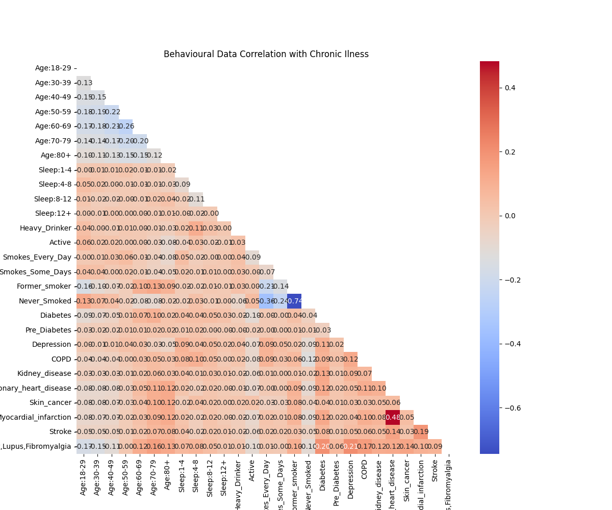

# Blog 4 -Risk Assessment of Chronic Illness Model Training and Evaluation with Logistical Regression & Random Forest

I created a correlation heat map with the balanced data to visualise the correlation between behaviours and chronic illnesses.

Challenges faced when training a model.

* The model does not place the user in a class but gives a risk assessment of the likelihood of them eventually being in that class. This is challenging because I am only using binary data(has a chronic illness or doesn’t).
* A user can have several illnesses or not have any which makes this a multi-classification problem.

These challenges led me to choose Logistic regression and Random Forest Classification to train my model. Logistical regression, although being a binary classifier, outputs the probability of an event occurring which suits my risk assessment however i it probabyly will not be able to handle the non-linear relationship between behaviours and ilnesses. Thats why I am also creating a Random Forest Classification model. Random Forest is an ensemble method that takes the mean prediction across several decision trees. For Random Forest risk assesment i will be taking the models probability for each ilness of the user best fiting into each of the classes. The proabilitys will be linked to the following risk levels: 
* 0.3 > : low risk
* 0.3 ->  0.7 :medium risk
* < 0.7 : high risk

For training im doing a random 70/30 data split. For reproducability i added a seed ("326") to the data splitting function which adds determinism.

## Results

### Accuracy

| ML Algorithm | Accurancy |
| ---- | ---- |
|  Logistical Regression | 0.22663185378590078  | 
|  Random Forest Classification | Precision | 

### Precison, Recall, F1-Score

<table>
  <tr>
    <td colspan="4">
      ML-Algorithm
    </td>
    <td colspan="1" >
      Ilnessess
    </td>
    <td >
      Metrics
    </td>
    <td colspan="4">
      Values
    </td>
  </tr>
<td rowspan="30" colspan="4" > 
        Logistical Regression
    </td>    
    <td rowspan=3>
        Diebetes
    </td>
    <td>
        Precision
    </td>
    <td>
        0.18421053
    </td>
  </tr>
  <tr>
     <td>
        Recall
     </td>
     <td>
        0.00558214
     </td>
  </tr>
  <tr>
    <td>
        F1-score
    </td>
    <td>
        0.01083591
  </tr>
   <td rowspan=3>
        Pre_Diebetes
    </td>
    <td>
        Precision
    </td>
    <td>
        0.
    </td>
  </tr>
  <tr>
     <td>
        Recall
     </td>
     <td>
        0.
    </td>
  </tr>
  <tr>
    <td>
        F1-score
    </td>
    <td>
        0.
    </td>
  </tr>
   <td rowspan=3>
        Depression
    </td>
    <td>
        Precision
    </td>
    <td>
        0.62776025
    </td>
  </tr>
  <tr>
     <td>
        Recall
     </td>
     <td>
        0.15706393
    </td>
  </tr>
  <tr>
    <td>
        F1-score
    </td>
    <td>
        0.25126263
    </td>
  </tr>
   <td rowspan=3>
        COPD
    </td>
    <td>
        Precision
    </td>
    <td>
        0.66573034
    </td>
  </tr>
  <tr>
     <td>
        Recall
     </td>
     <td>
        0.22170253
    </td>
  </tr>
  <tr>
    <td>
        F1-score
    </td>
    <td>
        0.33263158
    </td>
  </tr>
   <td rowspan=3>
        Kidney Disease
    </td>
    <td>
        Precision
    </td>
    <td>
        0.61562021
    </td>
  </tr>
  <tr>
     <td>
        Recall
     </td>
     <td>
        0.24202288
    </td>
  </tr>
  <tr>
    <td>
        F1-score
    </td>
    <td>
        0.3474503
    </td>
  </tr>
   <td rowspan=3>
        Angina/Coronary heart disease
    </td>
    <td>
        Precision
    </td>
    <td>
        0.65471884
    </td>
  </tr>
  <tr>
     <td>
        Recall
     </td>
     <td>
        0.72007233
    </td>
  </tr>
  <tr>
    <td>
        F1-score
    </td>
     <td>
        0.68584223
    </td>
  </tr>
   <td rowspan=3>
        Myocardial infarction
    </td>
    <td>
        Precision
    </td>
    <td>
        0.6779661
    </td>
  </tr>
  <tr>
     <td>
        Recall
     </td>
     <td>
        0.61840121
    </td>
  </tr>
  <tr>
    <td>
        F1-score
    </td>
    <td>
        0.64681522
    </td>
  </tr>
   <td rowspan=3>
        Stroke
    </td>
    <td>
        Precision
    </td>
    <td>
        0.55305466
    </td>
  </tr>
  <tr>
     <td>
        Recall
     </td>
     <td>
        0.3733044
    </td>
  </tr>
  <tr>
    <td>
        F1-score
    </td>
    <td>
        0.4457402
    </td>
  </tr>
   <td rowspan=3>
        Arthritis Gout Lupus Fibromyalgia
    </td>
    <td>
        Precision
    </td>
    <td>
        0.62117235
    </td>
  </tr>
  <tr>
     <td>
        Recall
     </td><td>
        0.33793432
    </td>
  </tr>
  <tr>
    <td>
        F1-score
    </td><td>
       0.4377312
    </td>
  </tr>
 <td rowspan=3>
        Skin Cancer
    </td>
    <td>
        Precision
    </td>
    <td>
        0.52185609
    </td>
  </tr>
  <tr>
     <td>
        Recall
     </td>
     <td>
        0.41342568
    </td>
  </tr>
  <tr>
    <td>
        F1-score
    </td>
    <td>
        0.46135553
    </td>
  </tr>

  <td rowspan="30" colspan="4" > 
        Random Forest Classification 
    </td>    
    <td rowspan=3>
        Diebetes
    </td>
    <td>
        Precision
    </td>
    <td>
        0.7063197
    </td>
  </tr>
  <tr>
     <td>
        Recall
     </td>
     <td>
        0.3030303
     </td>
  </tr>
  <tr>
    <td>
        F1-score
    </td>
    <td>
      0.42410714
  </tr>
   <td rowspan=3>
        Pre_Diebetes
    </td>
    <td>
        Precision
    </td>
    <td>
        0.64044944
    </td>
  </tr>
  <tr>
     <td>
        Recall
     </td>
     <td>
        0.33187773
    </td>
  </tr>
  <tr>
    <td>
        F1-score
    </td>
    <td>
        0.43720038
    </td>
  </tr>
   <td rowspan=3>
        Depression
    </td>
    <td>
        Precision
    </td>
    <td>
        0.69170579
    </td>
  </tr>
  <tr>
     <td>
        Recall
     </td>
     <td>
        0.34885556
    </td>
  </tr>
  <tr>
    <td>
        F1-score
    </td>
    <td>
        0.46379853
    </td>
  </tr>
   <td rowspan=3>
        COPD
    </td>
    <td>
        Precision
    </td>
    <td>
        0.78830645
    </td>
  </tr>
  <tr>
     <td>
        Recall
     </td>
     <td>
        0.36576239
    </td>
  </tr>
  <tr>
    <td>
        F1-score
    </td>
    <td>
        0.49968051
    </td>
  </tr>
   <td rowspan=3>
        Kidney Disease
    </td>
    <td>
        Precision
    </td>
    <td>
        0.70096852
    </td>
  </tr>
  <tr>
     <td>
        Recall
     </td>
     <td>
        0.34858519
    </td>
  </tr>
  <tr>
    <td>
        F1-score
    </td>
    <td>
        0.46562123
    </td>
  </tr>
   <td rowspan=3>
        Angina/Coronary heart disease
    </td>
    <td>
        Precision
    </td>
    <td>
        0.70536618
    </td>
  </tr>
  <tr>
     <td>
        Recall
     </td>
     <td>
        0.75587703
    </td>
  </tr>
  <tr>
    <td>
        F1-score
    </td>
     <td>
        0.7297486
    </td>
  </tr>
   <td rowspan=3>
        Myocardial infarction
    </td>
    <td>
        Precision
    </td>
    <td>
        0.70802377
    </td>
  </tr>
  <tr>
     <td>
        Recall
     </td>
     <td>
        0.71870287
    </td>
  </tr>
  <tr>
    <td>
        F1-score
    </td>
    <td>
        0.71332335
    </td>
  </tr>
   <td rowspan=3>
        Stroke
    </td>
    <td>
        Precision
    </td>
    <td>
        0.69310345
    </td>
  </tr>
  <tr>
     <td>
        Recall
     </td>
     <td>
        0.43624525
    </td>
  </tr>
  <tr>
    <td>
        F1-score
    </td>
    <td>
        0.53546454
    </td>
  </tr>
   <td rowspan=3>
        Arthritis Gout Lupus Fibromyalgia
    </td>
    <td>
        Precision
    </td>
    <td>
        0.68888889
    </td>
  </tr>
  <tr>
     <td>
        Recall
     </td><td>
        0.51642075
    </td>
  </tr>
  <tr>
    <td>
        F1-score
    </td><td>
          0.59031556
    </td>
  </tr>
 <td rowspan=3>
        Skin Cancer
    </td>
    <td>
        Precision
    </td>
    <td>
        0.66165414
    </td>
  </tr>
  <tr>
     <td>
        Recall
     </td>
     <td>
        0.56259989
    </td>
  </tr>
  <tr>
    <td>
        F1-score
    </td>
    <td>
        0.60811978
    </td>
  </tr>

</table>

## Refrences

[MultiOutputClassifier](https://scikit-learn.org/stable/modules/generated/sklearn.multioutput.MultiOutputClassifier.html)
[LogisticRegresion](https://scikit-learn.org/stable/modules/generated/sklearn.linear_model.LogisticRegression.html)
[RandomForestClassifier](https://scikit-learn.org/stable/modules/generated/sklearn.ensemble.RandomForestClassifier.html)
[Metrics](https://scikit-learn.org/stable/modules/model_evaluation.html)