# Life Lens technical Manual
by Michael Regan 22112111

## Dango App

## React App

### AuthFetchComp
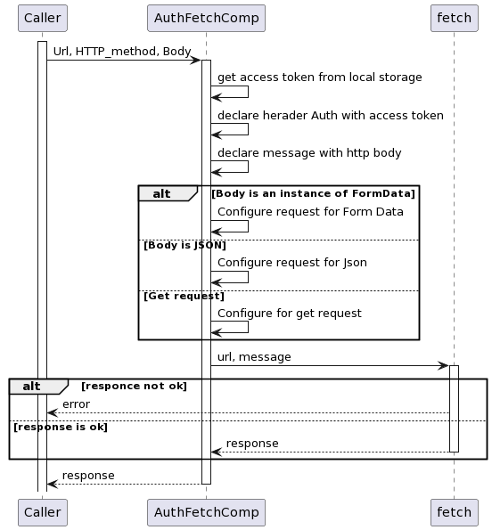

### Load Data
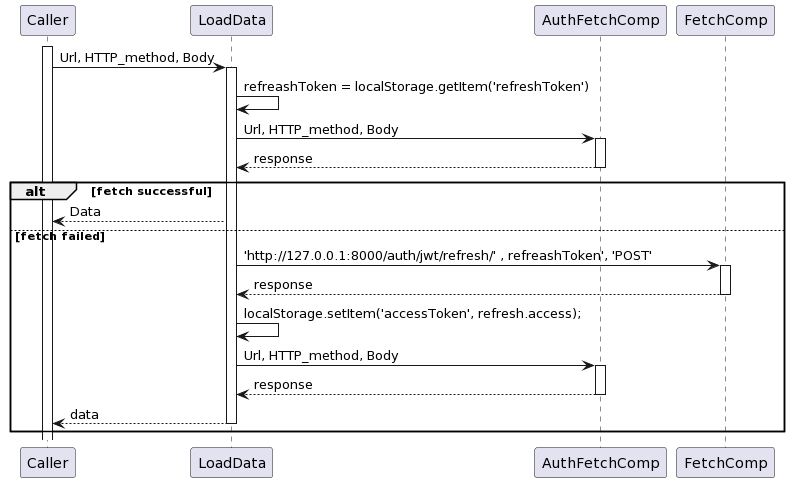

### Survey Forms
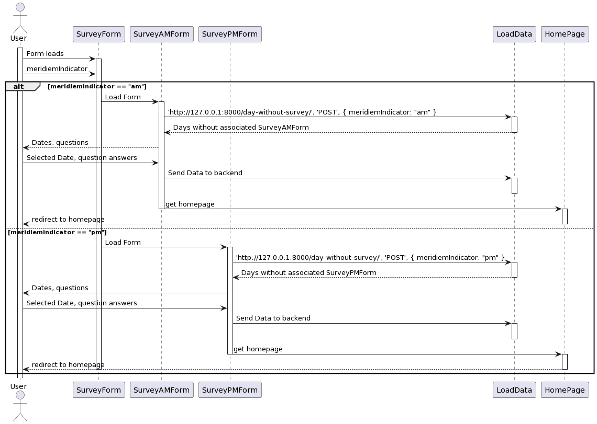

### Cronic Ilness risk assessment
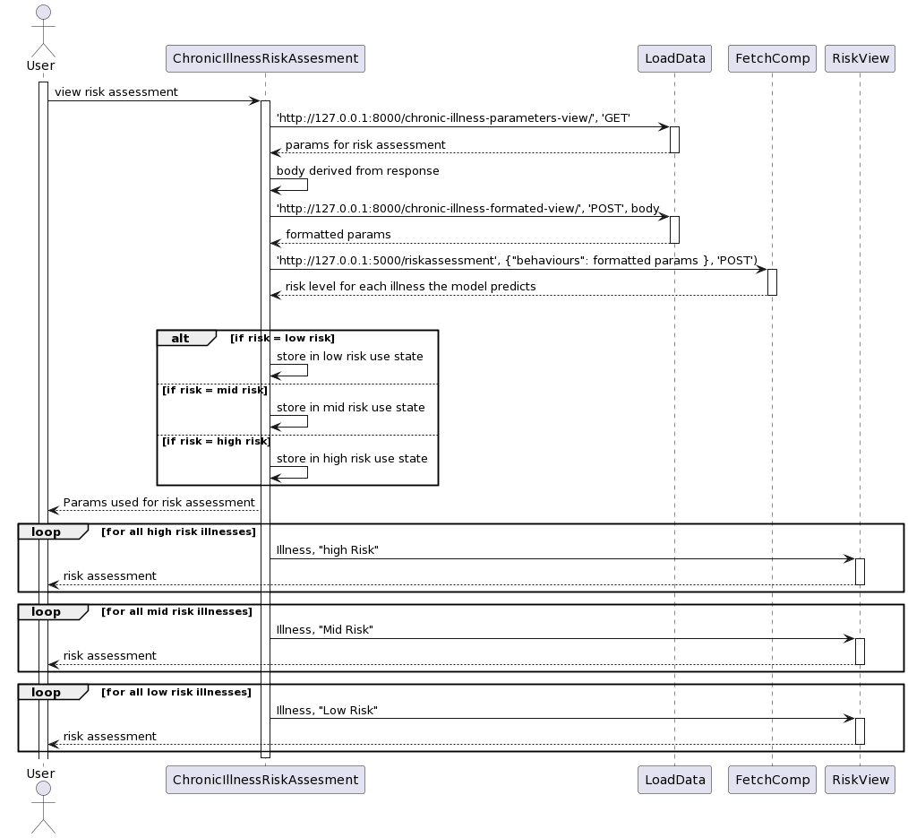

### Risk View
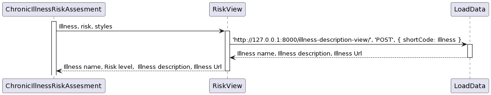

### getYearsMonthsDays
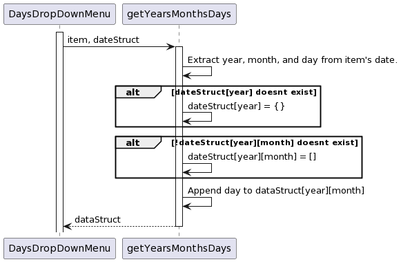

### Add Item or update duration
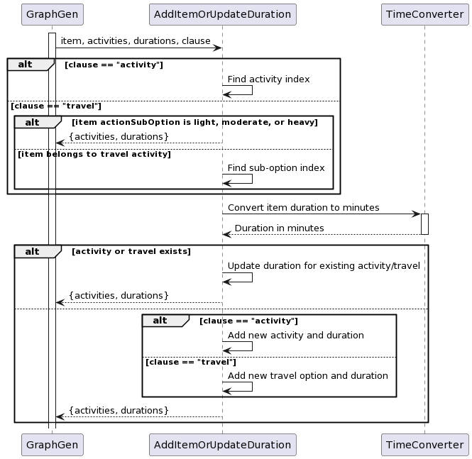

### Days Drop Down Menu
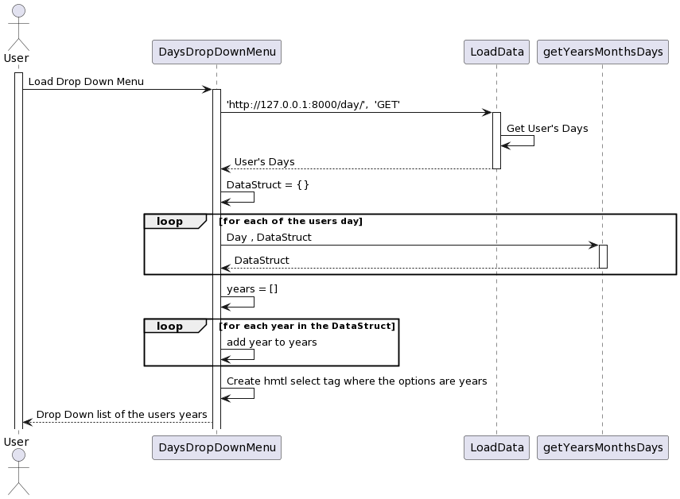

### Menu Select
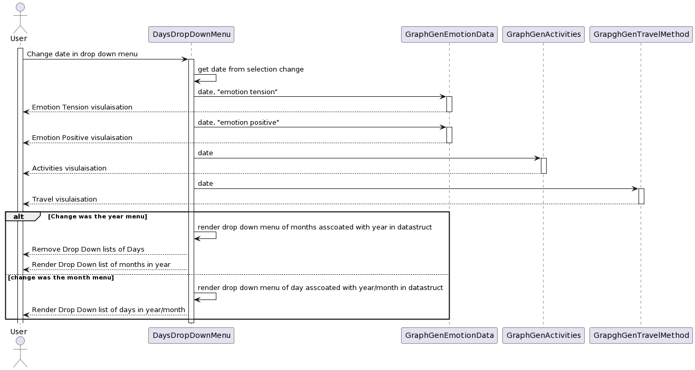

### Determine TimeSpan
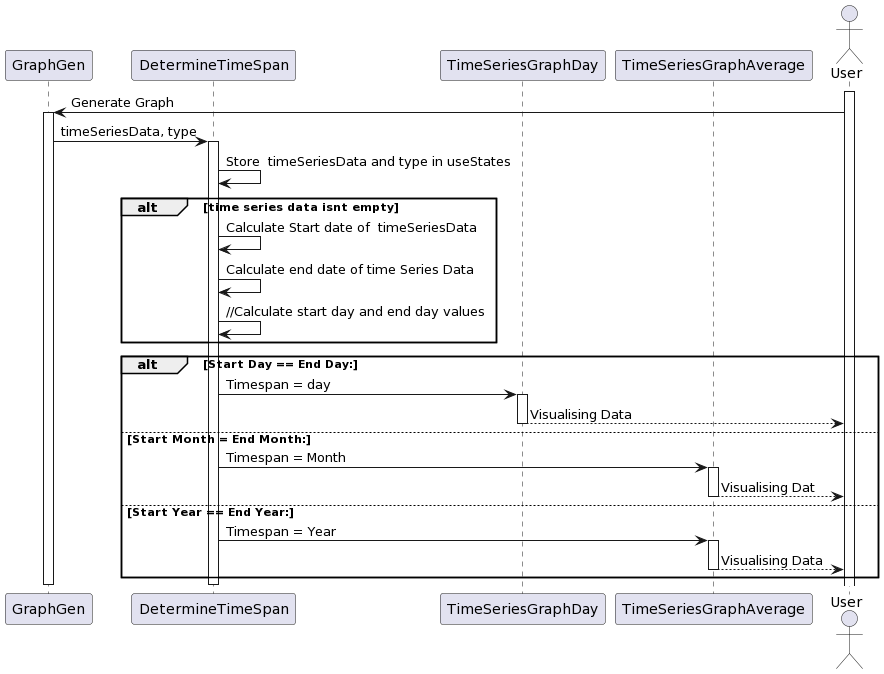

### TimeSeriesGraphAverage
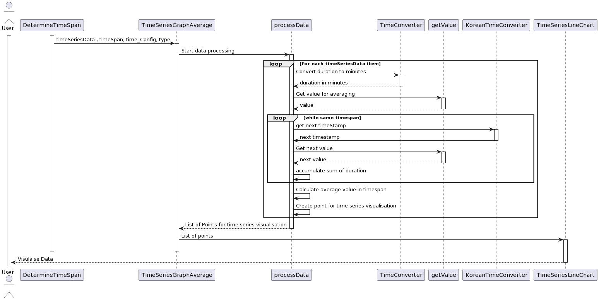

### TimeSeriesGraphDay
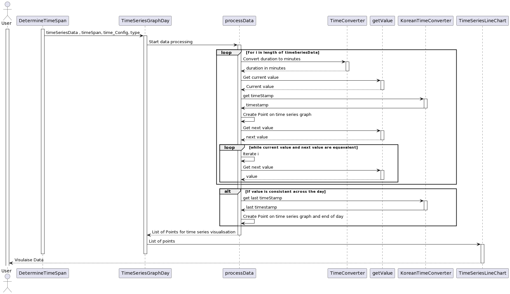

