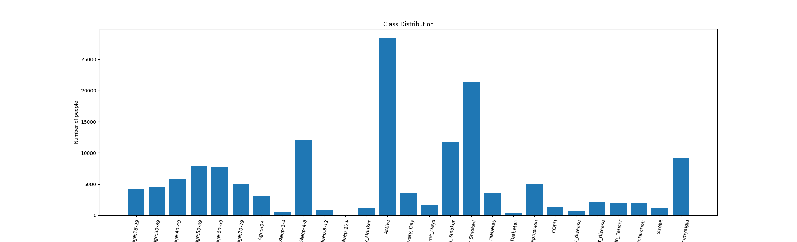

# Life Lens technical Manual
by Michael Regan 22112111

# 1. Introduction
## 1.1. OverView
Lifelens is a web application that visualises its user's life-log data and based on that data alongside other user data, the system predicts the user's current risk of 10 chronic illnesses. It achieves this from its 3 major components. The first is the Django-Backend REST API, where all user data is stored and permission to such data is authenticated, which is a priority due to the sensitive nature of life-log data. The second major component of the life-lens system is the React.js frontend which is the User Interface In which users will interact. The frontend is also responsible for the dynamic life-log data visualisations. The Final component is the Flask Backend, a REST API that queries a chronic illness risk assessment Random Forest Classification model trained using The CDC's Behavioural Risk Factor Servalence Survey Data.

# 2 System Architecture

## 2.1 Overview of system Components

## 2.2 Architectural Diagram

## 2.3 Distrabution of Functions

## 2.4 Reused and Third-Party Components

## 2.5 Security and Scalability Consterations

# 3 High Level Design

## 3.1 Design Overview

## 3.2 Component Interaction Diagram

## 3.3 Data Flow Diagram

## 3.4 Enity Relationship Diagram

## 3.5 Activity Diagrams for Django API requests

### 3.5.1 Daily Activity CSV Upload

### 3.5.2 Daily Activity View

### 3.5.3 Day View

### 3.5.4 Day View For Survey

### 3.5.5 Survey AM Upload

### 3.5.5 Survey PM Upload

### 3.5.6 Chronic Illness Parameters View

### 3.5.7 Chronic Illness Parameters View

### 3.5.8 Illness Description View

## 3.6 Sequence Diagrams for React Compnents

### 3.6.1 Authorisation system

#### 3.6.1.1 Authorisation Context

#### 3.6.1.2 Log In

#### 3.6.1.23 Log out

#### 3.6.1.4 Sign up

#### 3.6.1.5 Navbar Contol

### 3.6.2 Fetch Components

#### 3.6.2.2 Fetch Component with Authorisation

#### 3.6.2.3 Load Data with Automatic Authorisation

### Visualisation Menu

#### 3.6.3.1 Create Data Structure Containing Dates in which the User has Uploaded Data

#### 3.6.3.2 Load Menu for Visualisations

#### 3.6.3.3 Date Select for visualistations

### 3.6.4 Accumulate Activity Durations

### 3.6.5 Time Series Data Visualisation

#### 3.6.5.1 Determine Time Span

#### 3.6.5.2 Graph Data over a day

#### 3.6.5.3 Graph Averages over time

### 3.6.6 Surveys

#### 3.6.6.1 Survey Form

#### 3.6.6.2 Render Option Tags From Dictionary

### Chronic Illness Risk Assessment

#### 3.6.7.1 View Risk Assessment

#### 3.6.7.1 View Risk

# 4 Machine Learning 

# 4.1 Machine Leaning Overview

# 4.2 Data Decoding and Cleaning

# 4.3 Data Balancing

# 4.4 Data Normalisation

# 4.5 Model Training 

# 4.6 Model Selection

# 5 Problems and Resolutions

## 5.1 Identfied Issues

## 5.2 Resolution Strategies

## 5.3 Lessons Learned

## 5.4 Future Consideration

